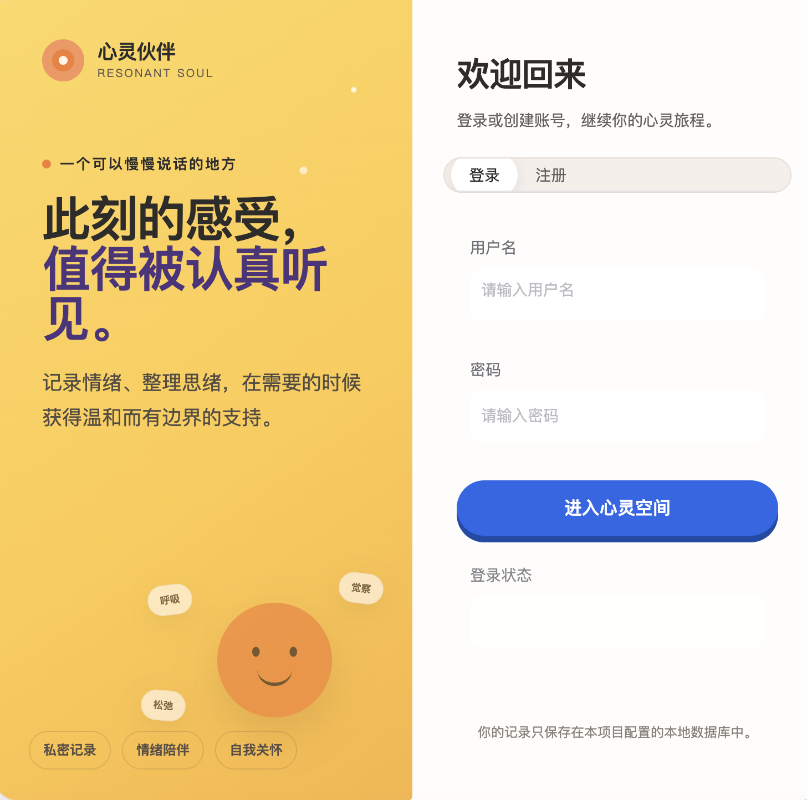
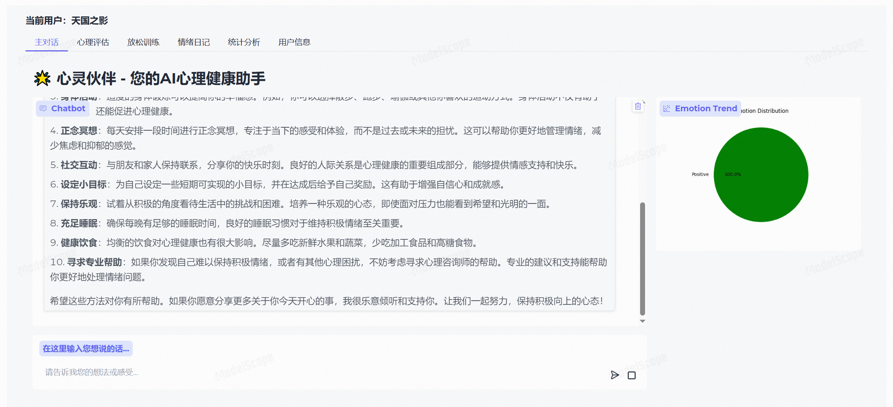
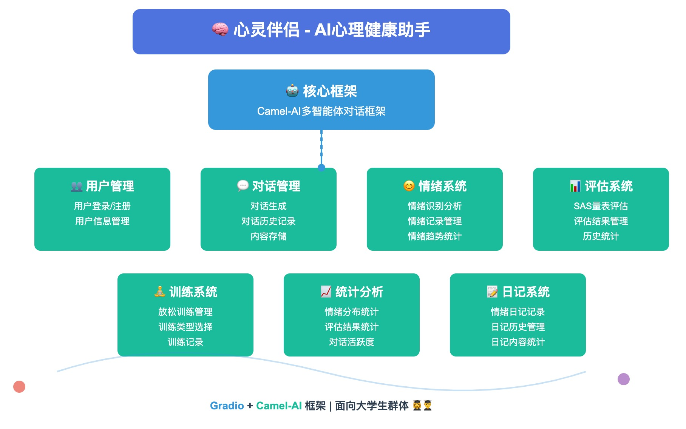

<div align="center">

# 心灵伙伴 · Resonant Soul

**面向大学生的 AI 情绪陪伴与自我观察工具**

[](https://www.python.org/)
[](https://www.gradio.app/)
[](https://github.com/camel-ai/camel)
[](https://modelscope.cn/studios/Datawhale/resonant-soul/summary)

[在线体验](https://modelscope.cn/studios/Datawhale/resonant-soul/summary) · [功能介绍](#核心功能) · [快速开始](#快速开始) · [Docker 部署](#docker-部署)

</div>

---

心灵伙伴是一个基于 **Gradio** 与 **CAMEL-AI** 构建的心理健康支持系统。它通过陪伴式对话、情绪记录、自我评估、放松练习和趋势统计，帮助用户看见情绪变化、整理当下感受。

项目无需模型密钥即可使用：未配置 `LLM_API_KEY` 时会自动进入离线演示模式；接入兼容 OpenAI 协议的模型服务后，即可启用完整的多智能体对话。

> [!IMPORTANT]
> 本项目只提供一般性的情绪支持与自我观察工具，不是医疗器械，也不能替代专业心理咨询、医学诊断或治疗。如你或他人正面临紧急危险，请立即联系身边可信任的人、当地急救或报警服务。

## 界面预览

| 登录与注册 | 陪伴对话 |
| --- | --- |
|  |  |

<details>
<summary>查看项目需求概览</summary>



</details>

## 核心功能

| 模块 | 能力 |
| --- | --- |
| 陪伴对话 | 支持性 AI 对话、上下文展示、对话记录持久化 |
| 情绪识别 | 根据用户表达识别情绪，并生成情绪分布图 |
| 情绪自评 | 五项情绪状态自评、结果解读与历史统计 |
| 放松练习 | 呼吸放松、渐进性肌肉放松、正念冥想引导 |
| 情绪日记 | 按时间回顾表达内容及对应的情绪记录 |
| 成长轨迹 | 汇总近 7 天情绪分布、评估结果和对话活跃度 |
| 用户系统 | 注册、登录、资料查看、密码修改与数据隔离 |
| 管理后台 | 用户列表、账号状态管理与用户删除 |
| 离线演示 | 无需 API Key 即可体验完整界面和基础回复流程 |

## 技术架构

```text
Gradio Web UI
      │
      ├── 用户与管理员功能
      ├── 情绪识别 / 自评 / 统计
      └── 陪伴对话
              │
              ├── 离线演示回复（无 API Key）
              └── CAMEL-AI + OpenAI 兼容模型服务
      │
Peewee ORM ── SQLite
```

- **界面层：** Gradio 5
- **智能体框架：** CAMEL-AI
- **模型接口：** OpenAI-compatible API
- **数据层：** Peewee + SQLite
- **数据分析：** Matplotlib

## 快速开始

### 1. 获取项目

```bash
git clone <your-repository-url>
cd resonant-soul
```

请将 `<your-repository-url>` 替换为你发布后的 GitHub 仓库地址。

### 2. 创建环境并安装依赖

需要 Python 3.10 或更高版本。

```bash
python -m venv .venv
source .venv/bin/activate
python -m pip install --upgrade pip
python -m pip install -e .
```

Windows PowerShell 请使用：

```powershell
.venv\Scripts\Activate.ps1
```

如果已安装 [uv](https://docs.astral.sh/uv/)，也可以使用锁定版本快速创建环境：

```bash
uv sync --python 3.10 --frozen
```

### 3. 准备配置

```bash
cp .env.example .env
```

Windows PowerShell：

```powershell
Copy-Item .env.example .env
```

保留 `LLM_API_KEY` 为空即可使用离线演示模式。如果要启用模型对话，请编辑 `.env`：

```dotenv
LLM_API_KEY=your-api-key
LLM_MODEL_TYPE=Qwen/Qwen2.5-7B-Instruct
LLM_MODEL_URL=https://api-inference.modelscope.cn/v1/
```

`LLM_MODEL_URL` 可替换为其他兼容 OpenAI 协议的接口地址，模型名称也需要同步调整。

### 4. 启动应用

```bash
python app.py
```

浏览器访问 [http://127.0.0.1:7860](http://127.0.0.1:7860)。首次启动时会自动创建 SQLite 数据库和所需数据表。

## 配置说明

| 环境变量 | 默认值 | 说明 |
| --- | --- | --- |
| `LLM_API_KEY` | 空 | 模型服务密钥；为空时启用离线演示模式 |
| `LLM_MODEL_TYPE` | `Qwen/Qwen2.5-7B-Instruct` | 模型名称 |
| `LLM_MODEL_URL` | ModelScope API 地址 | 兼容 OpenAI 协议的模型接口地址 |
| `ADMIN_USERNAME` | `admin` | 管理员用户名 |
| `ADMIN_PASSWORD` | 空 | 管理员密码；为空时不创建管理员账号 |
| `ADMIN_NAME` | `系统管理员` | 管理员昵称 |
| `DB_PATH` | `mindmate.db` | SQLite 数据库文件路径 |
| `HOST` | `127.0.0.1` | 服务监听地址 |
| `PORT` | `7860` | 服务监听端口 |
| `GRADIO_SHARE` | `false` | 是否创建 Gradio 临时公网链接 |

> [!TIP]
> 如需使用管理后台，请在首次启动前设置一个唯一且足够强的 `ADMIN_PASSWORD`。应用只会在该变量非空时初始化管理员账号。

## Docker 部署

先根据 `.env.example` 创建 `.env`，再执行：

```bash
docker build -t resonant-soul:local .
docker run --env-file .env -p 7860:7860 resonant-soul:local
```

容器默认监听 `0.0.0.0:7860`，启动后访问 `http://localhost:7860`。如需保留容器重建前的数据，建议将 SQLite 数据库文件挂载到持久化存储。

## 运行测试

```bash
pytest -q
```

## 项目结构

```text
resonant-soul/
├── api/
│   ├── apps/              # 用户、对话、情绪、自评、统计与管理功能
│   ├── db/                # Peewee 数据模型与数据访问服务
│   ├── utils/             # 配置、日志与加密工具
│   └── settings.py        # 应用运行配置
├── assets/                # Gradio 自定义样式
├── conf/                  # 基础服务配置
├── docker/                # 容器启动脚本
├── resources/             # README 图片资源
├── test/                  # 自动化测试
├── app.py                 # Gradio 应用入口
├── Dockerfile
├── pyproject.toml
└── README.md
```

## 数据与安全

- 用户、对话、自评和情绪数据默认保存在运行实例的本地 SQLite 数据库中。
- `.env` 与本地数据库文件已加入 `.gitignore`；请勿提交真实 API Key、密码或用户数据。
- 用户密码采用带随机盐的 PBKDF2-SHA256 哈希保存，并兼容旧版 SHA-256 密码的迁移升级。
- 危机提示与情绪识别属于基础辅助机制，不能代替人工风险评估。
- 五项情绪状态自评仅用于产品演示和自我观察，不是标准 SAS 或其他临床量表。


## 项目来源与致谢

本项目基于开源项目 [datawhalechina/resonant-soul](https://github.com/datawhalechina/resonant-soul) 二次开发，在其基础上完成了界面、用户系统、情绪记录与自评、放松练习、趋势回顾、管理后台、Docker 部署与自动化测试等方向的迭代。

感谢 Datawhale 及原项目贡献者开放这份工作。上游仓库当前未附带 LICENSE 文件，因此本仓库同样暂不声明开源许可证，请勿默认用于商业分发或二次授权；如需商用，请先与上游权利人确认授权。若后续上游补充许可证，本仓库将同步遵循。

## 关于本项目

- 作者：陶越
- 定位：毕业设计 / 个人作品，用于展示 AI 情绪陪伴类产品的完整实现与安全边界设计
- 相关作品：[观象](https://github.com/Tao716/guanxiang)、[飞书会后执行官](https://github.com/Tao716/feishu-hackathon)、[午夜账簿](https://github.com/Tao716/ai-mini-game)

